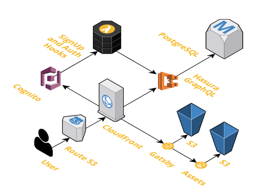

# NearForm 🤓 Knowledgebase

[](https://circleci.com/gh/nearform/knowledgebase)
[](https://lernajs.io/)

This repository is a collection of packages that can be used as a foundation for a statically built, GraphQL-driven knowledgebase.

## Architecture

The project architecture follows a JAMStack, Serverless application model. The picture shows a high level architecture diagram.



## Project structure

The application is stored in a [lerna](https://github.com/lerna/lerna) monorepo.

### [./.circleci](./.circleci)

CircleCI [knowledgebase project](https://circleci.com/gh/nearform/knowledgebase) continuous integration configuration.

### [./hasura](./hasura)

The application follows a serverless application model, where the only API used by the frontend is exposed through GraphQL via [Hasura](https://hasura.io).

This folder contains the migrations and scripts necessary to run them.

### [./infra](./infra)

The infrastructure is managed via Terraform and provisioned to AWS.

This folder contains all the files and scripts to provision the infrastructure.

### [./packages/components](./packages/components)

> note, this package is currently, temporarily unused until we sort out the direction we want to go with the design system

- a component library based on [styled-components](https://www.styled-components.com/)
- a design system with a `ThemeProvider` approach to theming and using
  [saluki](https://github.com/nearform/saluki) for its CSS-in-JS modular
  approach with sane defaults similar in concept to [tailwind](https://tailwindcss.com/docs/what-is-tailwind/)

### [./packages/app](./packages/app)

- a static build enabled app based on [gatsby](https://www.gatsbyjs.org)
- Gatsby uses [graphql](https://graphql.org/) to fetch data from the API

### [./packages/functions](./packages/functions)

- lambda serverless functions used to interact with AWS Cognito and Hasura

## Project setup

### 1. Clone and install dependencies

```
git clone https://github.com/nearform/knowledgebase.git

cd knowledgebase

npm i
```

### 2. Configure

Most of the configuration comes from environment variables. Required environment variables for each part of the architecture are documented in the `.env.sample` files inside the repository.

- app [`.env.sample`](./packages/app/.env.sample) - build time environment variables for the Gatsby application. They should also be configured in CI, along with any other environment variables required by CI
- hasura [`.env.sample`](./hasura/.env.sample) - runtime environment variables for Hasura and Hasura console. They need to be configured when running Hasura or Hasura console.
- functions [`.env.sample`](./packages/functions/.env.sample) - runtime environment variables for AWS Lambda functions.

Shared secrets are stored in a vault. Get in touch with a team member to get access to it.

### 3. Provision

Infrastructure provisioning is done via Terraform. Check out the instructions in the [infra](.infra) directory.

## Storybook

The components package contains storybook stories to document and test the components contained therein.

```
cd packages/components
npm run storybook
```

## Running the application

Ensure you have a local `.env.development` file available.

```
cd packages/app
npm start
```

## Adding new dependencies

```
npx lerna add <npm-package-name> --scope=<package/module>
npx lerna add -D <npm-package-name> --scope=<package/module> // for dev dependencies
```
