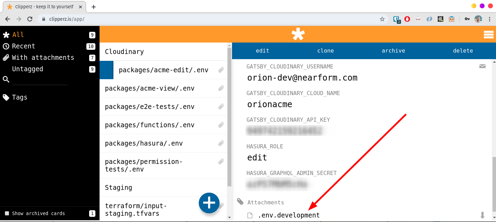
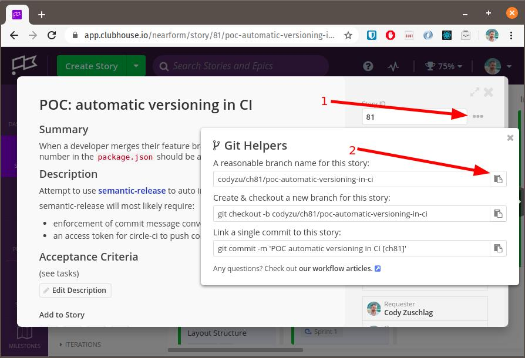

# Quick Start


## Project Setup

### 1. Clone and install dependencies ⬇️

**🔧 Tooling:** The project uses node.js and [yarn "classic"](https://classic.yarnpkg.com). You must have both installed.

#### 🚀 Execute the following commands:
```bash
git clone https://github.com/nearform/orion.git
cd orion
yarn
```

**🔧 Tooling:** The repo uses [lerna](https://lerna.js.org/) and [yarn workspaces](https://classic.yarnpkg.com/en/docs/workspaces/) to work as monorepo. The individual packages are located in the `packages` sub directory.

### 2. IDE setup ⚙️

Orion uses the [xo linter 🐛](https://github.com/xojs/xo). It is very strict and is intended to eliminate all style debates.

Developers are assumed to be using VSCode. Use other IDEs at your own risk.

#### 🚀 Install the [XO extension for VSCode](https://marketplace.visualstudio.com/items?itemName=samverschueren.linter-xo)

ℹ️ **Info:** There are [xo extensions](https://github.com/xojs/xo#editor-plugins) for other IDEs. Use them at your own risk.

#### 🚀 For the best VSCode experience, enable the xo formatter and the format on save options:

```json
{
  "editor.formatOnSave": true,
  "xo.enable": true,
  "xo.format.enable": true
}
```

💡 **Pro tip:** The linter only works in VSCode when opening the project from the root of the the monorepo. Opening individual packages will lead to headaches 🤕💊.


### 3. Configure ⚙️

Configuration happens through environment variables.

**🔧 Tooling:** Environment variables are loaded with [env-cmd](https://www.npmjs.com/package/env-cmd) or [dotenv](https://www.npmjs.com/package/dotenv) depending on the pacakage.

Required environment variables for each package are documented in the `.env.sample` files inside the associated packages.

The following packages distinguish between `.env.development` and `.env.production` when running in development mode or building for production:
* `acme-edit`
* `gatsby-plugin-orion-view`

The package `hasura` does not make a distinction and has a single `.env` file.

#### 🚀 Download the required `.env.development` files *for each package* from [clipperz](https://clipperz.is/app/) (ask a team member for the credentials). Ignore the individual secrets and simply download the attached file and ensure it is saved with the correct name.



## Run

### 1. Launch the sites locally 💻

#### 🚀 Run the command(s) for the site(s) you want develop:

```bash
yarn start:view
yarn start:edit
```

### 2. Debug the sites in your browser 🚫🐛

Once Gatsby successfully builds and starts the development server(s) the sites can be debugged in your browser.

#### 🚀 Navigate to http://localhost:8000 (view), or http://localhost:8001 (edit) as required.

### 3. Storybook 📖

As appropriate, individual components should be demo'able in storybook.

#### 🚀 Run story book locally:

```bash
yarn storybook
```

#### 🚀 View the staging version of storybook at https://orion-storybook.nearform.com

## Contribute 📝

### 1. Prepare 👨‍🏭

#### 🚀 Pick a story to work on from the [clubhouse project](https://app.clubhouse.io/nearform/stories).

#### 🚀 Work on a new branch, using the [name suggested by clubhouse](https://help.clubhouse.io/hc/en-us/articles/207540323-Using-the-Clubhouse-GitHub-Integration-with-Branches-and-Pull-Requests) by clicking on the github helpers button on your story.

Clubhouse will suggest the convention `{username}/ch{story number}/{story-summary}`. For example `codyzu/ch81/poc-automatic-versioning-in-ci`.



### 2. Commit ⬆️

#### 🚀 Run `yarn commit` in the console

👆 This is _the easy way to commit_ and will guide you through the commit conventions!

Staged changes and commit messages are linted. You have been warned. Seemingly incoherent linting problems during commits could be due to missing changes in the git staging area.

**💡 Pro Tip:**  If your commit fails (linting or other problems), it can retried with `yarn commit --retry` (see [commitizen's docs](https://github.com/commitizen/cz-cli#retrying-failed-commits) for details).

**💡 Pro Tip:** When prompted for "Issues this commit closes" using the format `[ch1234]`. This will link your commit to your story.

**⚠️ Warning:** When prompted for "BREAKING CHANGE", **_leave the prompt blank and press enter_** (unless you have a breaking change to report). Entering `n` or `none` will result in a new major version and a corresponding note in the changelog!

**🚑 _In case of emergency_** (or when rebasing), you can disable commit linting by deactivating git hooks with either of the following:

- `yarn commit --no-verify`
- `git commit --no-verify ...`
- `HUSKY_SKIP_HOOKS=1 git ...`

### 2. Github PR and Review 🔍

#### 🚀 Create a pull request in Github and ask someone to review it.

### 3. Merge into master 🔀

#### 🚀 Ensure your branch is built successfully by [Circle CI](https://circleci.com/gh/nearform/workflows/orion)

#### 🚀 Once approved, you as the author of the PR should merge it.

**⚠️ Warning:** Every developer is responsible that their merge into master builds successfully in [Circle CI](https://circleci.com/gh/nearform/workflows/orion).

### 4. Deploy to Staging 🏭

Deploying master into staging can be done by anyone.

#### 🚀 Create a PR merging _from_ `master` _into_ `staging` and merge it to trigger a staging deployment

**⚠️ Warning:** Ensure your deployment succeeds by monitoring [Circle CI](https://circleci.com/gh/nearform/workflows/orion).
